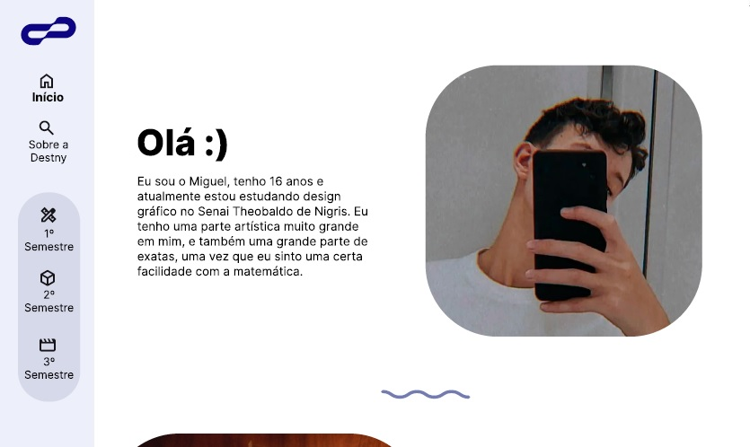

# destny

Olá :)
Seja bem vindo ou bem vinda ao código da página da minha marca pessoal, a Destny.
Esse código foi feito durante as aulas de HTML do Curso de Design Gráfico do Senai Theobaldo De Nigris.

## Briefing

O briefing passado pelo professor requeria que:  
• Tivesse transições em todas as páginas;  
• Tivesse no mínimo 4 páginas;  
• Que fosse criado um Wireframe do website;  
• E Que tivesse páginas individuais para cada semestre.  

## Wireframe

Diante do briefing passado, um wireframe (protótipo) foi criado no figma.  

## Fontes e Imagens 

A fonte utilizada no projeto foi a família Inter, mais específicamente, a Inter Regular e a Inter Bold.  
Já para as imagens, elas foram escolhidas do banco de imagens do Freepik e do Pexels, utilizando no Pexels, fotos da: 

• Flo Dahm ;  
• Letícia Ribeiro ;  
• Maksim Goncharenok ;  
• Olia Danielevich.  
